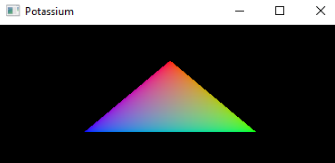

# A Win32 Vulkan triangle

This is just a simple Hello triangle using the Vulkan API and Win32 written in C.

I found that there were not many examples out there using the Vulkan API
without a platform abstraction library such as GLFW or SDL. These platforms are fine
I've used them and think theyre great but I think its important to dig down to the
platform level to see what those librarys are doing under the hood. 
There are also not many examples of using VUlkan in plain C
(most are in C++) depsite Vulkan being a C library.
I thought that was weird so I made one.

In the future I plan on using this for an intro to Vulkan article.

## TODO
- Clean up the code a bit
- Write an article.

